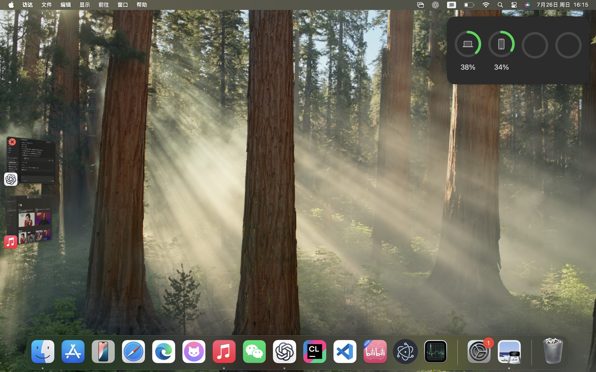
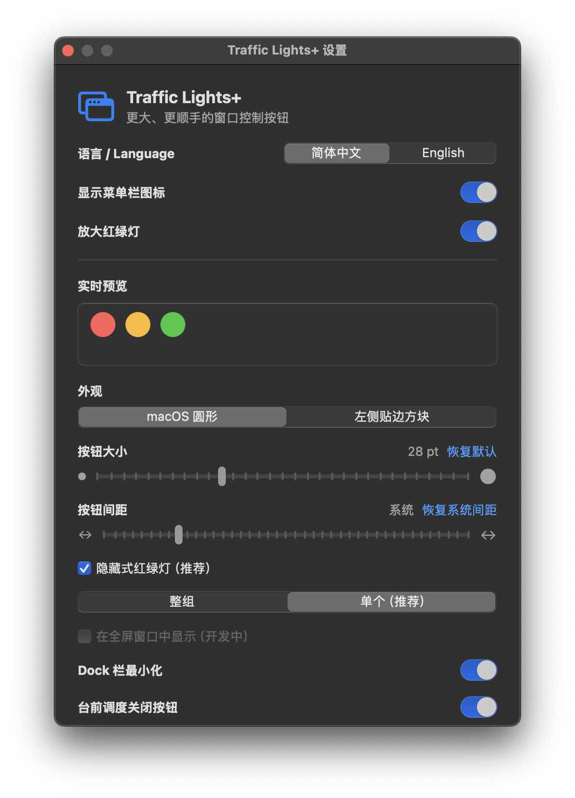
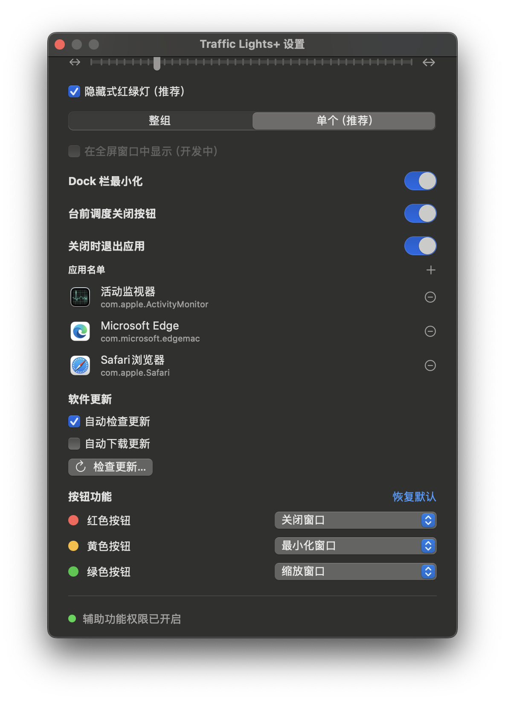
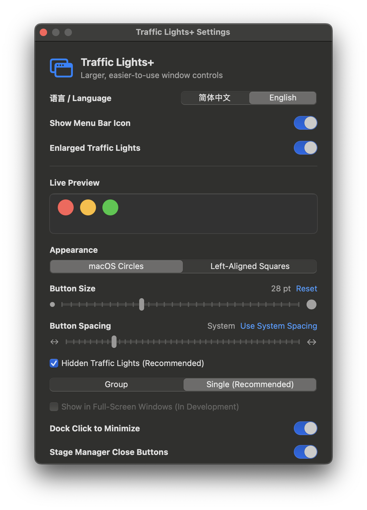
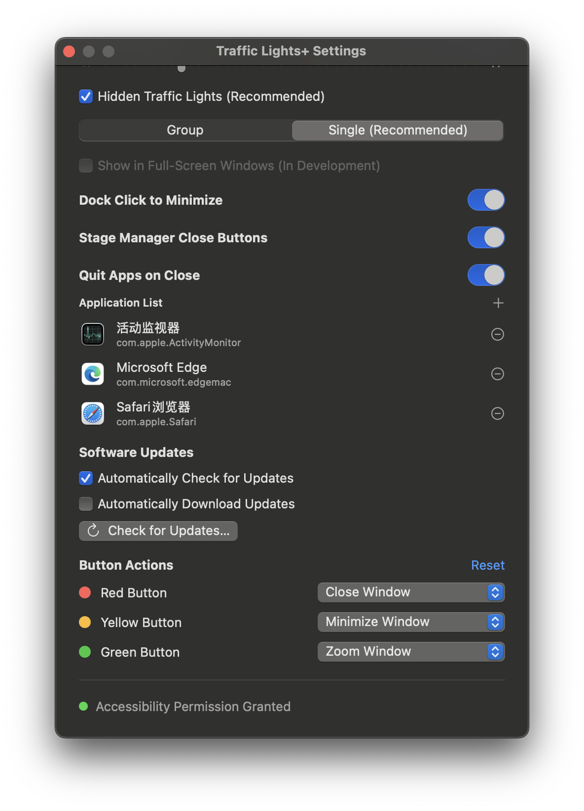

# BigLights

[](https://github.com/Liu223344/traffic-light-plus/actions/workflows/ci.yml)
[](https://github.com/Liu223344/traffic-light-plus/releases/latest)
[](https://www.apple.com/macos/)
[](LICENSE)

[简体中文](#简体中文) | [English](#english)

## 功能预览 / Feature Preview

<p align="center">
  <a href="docs/images/enlarged-traffic-lights.jpg">
    
  </a>
  <br>
  <sub>放大红绿灯 / Enlarged traffic lights</sub>
</p>

<p align="center">
  <a href="docs/images/stage-manager-close-button.jpg">
    
  </a>
  <br>
  <sub>台前调度缩略图关闭按钮 / Stage Manager thumbnail close button</sub>
</p>

## 简体中文

BigLights 是一个原生 macOS 菜单栏工具，可以把其他应用窗口左上角的关闭、最小化和缩放按钮放大，让它们更容易看清和点击。它不修改系统文件、不注入其他进程，也不需要关闭 SIP。

### 界面预览

<table>
  <tr>
    <td width="50%" align="center">
      <a href="docs/images/settings-zh-hans-top.png">
        
      </a>
    </td>
    <td width="50%" align="center">
      <a href="docs/images/settings-zh-hans-bottom.png">
        
      </a>
    </td>
  </tr>
  <tr>
    <td align="center"><sub>设置上半部分</sub></td>
    <td align="center"><sub>设置下半部分</sub></td>
  </tr>
</table>

### 下载

从 [Releases](https://github.com/Liu223344/traffic-light-plus/releases/latest) 下载最新版：

- `Traffic-Lights-Plus-<版本>-arm64.dmg`：Apple Silicon Mac，推荐。
- `Traffic-Lights-Plus-<版本>-x86_64.dmg`：Intel Mac，推荐。
- `Traffic-Lights-Plus-<版本>-arm64.zip`：Apple Silicon Mac 的免 DMG 压缩包。
- `Traffic-Lights-Plus-<版本>-x86_64.zip`：Intel Mac 的免 DMG 压缩包。
- `SHA256SUMS.txt`：用于校验下载文件。

当前公开构建使用 ad-hoc 签名，尚未经过 Apple 公证。macOS 首次阻止启动时，请在 Finder 中右键应用并选择“打开”。

### 功能

- 红绿灯尺寸可在 `18-48 pt` 范围内调整。
- 圆形按钮支持自定义间距，也可切换为左上角贴边方块。
- “隐藏式红绿灯”支持靠近时放大“整组”或仅放大“单个”最近按钮。
- 在当前活跃窗口中悬停配置为“缩放窗口”的放大按钮，可打开 macOS 原生缩放与平铺菜单。
- 窗口拖动期间以 120 Hz 同步位置，并实时处理按钮级遮挡。
- 最小化前快速缩小并隐藏覆盖按钮，避免覆盖层留在系统动画中。
- 再次点击当前前台应用的 Dock 图标时，可最小化该应用的当前窗口。
- 鼠标靠近台前调度缩略图左上角时显示关闭按钮，直接关闭分组中最上层的窗口。
- 可分别把红、黄、绿按钮设置为关闭窗口、退出应用、最小化、缩放、隐藏应用或无操作。
- 支持所有可见普通窗口和多显示器；全屏窗口支持仍在开发中。
- 设置界面支持简体中文和英文，可在应用内即时切换。
- 可选择隐藏菜单栏里的 BigLights 图标；隐藏后重新打开应用即可进入设置。
- 默认定期检查并后台下载正式版更新，安装和重启前由用户确认。
- 设置即时生效并通过 `UserDefaults` 保存在本机。
- 除软件更新外无网络请求；无分析统计、遥测、广告和账号系统。

### 系统要求

- macOS 13 Ventura 或更高版本。
- Apple Silicon 或 Intel Mac，请下载与芯片架构对应的发布文件。
- 目标应用需要提供标准 macOS 辅助功能窗口按钮。

### 安装与权限

1. 下载并打开 DMG，将 `BigLights.app` 拖入“应用程序”。
2. 启动 BigLights，从菜单栏图标打开“设置”。
3. 点击“打开辅助功能设置”，在“隐私与安全性 > 辅助功能”中允许 BigLights。
4. 如果应用已在权限列表中但仍未生效，请关闭并重新启动应用。

辅助功能权限仅用于发现标准窗口按钮、读取窗口位置并执行用户配置的窗口操作。完整说明见 [PRIVACY.md](PRIVACY.md)。

### 使用

BigLights 启动后常驻菜单栏。设置页可以调整：

- 放大红绿灯开关、尺寸、外观和圆形按钮间距；
- 隐藏式红绿灯及“整组/单个”放大方式；
- 红、黄、绿三个按钮各自的操作；
- 独立的“关闭时退出应用”开关和应用名单，关闭放大红绿灯后仍然生效；
- “在全屏窗口中显示（开发中）”当前不可勾选。
- 独立的 Dock 开关：再次点击应用图标时最小化当前窗口，无需开启放大红绿灯。
- 独立的台前调度关闭按钮开关：在缩略图左上角直接关闭当前最上层窗口。
- “语言 / Language”可在简体中文和英文之间即时切换。
- “显示菜单栏图标”可单独关闭；隐藏图标后可重新打开应用进入设置。
- “软件更新”可分别控制自动检查、自动下载，也可立即手动检查。

隐藏模式开启时，将鼠标移到窗口左上角红绿灯区域即可显示放大按钮。单个模式会选择距离鼠标最近的可见按钮，按钮被其他窗口遮挡时不会显示或参与选择。

### 已知限制

- 使用自行绘制标题栏、未暴露标准 AX 按钮的应用可能无法使用。
- 覆盖按钮属于独立的非激活面板，无法真正加入其他应用的窗口合成树。
- 当前公开构建未公证，因此首次启动可能出现 Gatekeeper 提示。
- `v1.3.0` 及更早版本不包含更新器，需要手动安装一次 `v1.4.0`，之后才能自动升级。

### 从源码构建

需要 Xcode Command Line Tools：

```sh
git clone https://github.com/Liu223344/traffic-light-plus.git
cd traffic-light-plus
swift test
./scripts/build-app.sh
open "build/BigLights.app"
```

`build-app.sh` 默认构建当前 Mac 的原生架构，也可以显式指定：

```sh
TARGET_ARCH=arm64 ./scripts/build-app.sh
TARGET_ARCH=x86_64 ./scripts/build-app.sh
```

生成两种架构的独立发布文件：

```sh
./scripts/package-dmg.sh
./scripts/package-zip.sh
```

产物分别带有 `-arm64` 和 `-x86_64` 后缀。发布打包使用独立临时应用，不会覆盖 `build/BigLights.app` 中的本机开发构建。

默认使用 ad-hoc 签名。持有 Developer ID 的发布者可以设置：

```sh
SIGNING_IDENTITY="Developer ID Application: Your Name (TEAMID)" ./scripts/package-dmg.sh
```

### 实现方式

macOS 没有公开 API 可以跨进程修改原生红绿灯尺寸。本项目使用辅助功能 API 获取标准窗口按钮和执行操作，使用 WindowServer 窗口信息匹配位置与遮挡，再通过三个独立的非激活透明面板绘制放大按钮。所有处理均在本机完成。

### 参与贡献

提交改动前请阅读 [CONTRIBUTING.md](CONTRIBUTING.md)，并至少运行：

```sh
swift test
./scripts/build-app.sh
codesign --verify --deep --strict "build/BigLights.app"
```

安全问题请按 [SECURITY.md](SECURITY.md) 中的方式报告，不要直接公开未修复漏洞。

### 许可证

BigLights 采用 [MIT License](LICENSE)。

## English

BigLights is a native macOS menu bar utility that enlarges the close, minimize, and zoom controls in the top-left corner of other application windows, making them easier to see and click. It does not modify system files, inject code into other processes, or require System Integrity Protection to be disabled.

### Interface Preview

<table>
  <tr>
    <td width="50%" align="center">
      <a href="docs/images/settings-en-top.png">
        
      </a>
    </td>
    <td width="50%" align="center">
      <a href="docs/images/settings-en-bottom.png">
        
      </a>
    </td>
  </tr>
  <tr>
    <td align="center"><sub>Settings, top section</sub></td>
    <td align="center"><sub>Settings, bottom section</sub></td>
  </tr>
</table>

### Download

Download the latest version from [Releases](https://github.com/Liu223344/traffic-light-plus/releases/latest):

- `Traffic-Lights-Plus-<version>-arm64.dmg`: recommended for Apple Silicon Macs.
- `Traffic-Lights-Plus-<version>-x86_64.dmg`: recommended for Intel Macs.
- `Traffic-Lights-Plus-<version>-arm64.zip`: ZIP package for Apple Silicon Macs.
- `Traffic-Lights-Plus-<version>-x86_64.zip`: ZIP package for Intel Macs.
- `SHA256SUMS.txt`: checksums for verifying downloaded files.

Public builds currently use ad-hoc code signing and are not notarized by Apple. If macOS blocks the app on first launch, right-click it in Finder and choose **Open**.

### Features

- Adjustable traffic-light control size from `18-48 pt`.
- Custom spacing for circular controls, with an optional left-edge square style.
- Hidden traffic lights can reveal the entire group or only the nearest individual control.
- Hover over an enlarged control configured to zoom the active window to open the native macOS zoom and tiling menu.
- Window positions are synchronized at 120 Hz while dragging, with real-time per-control occlusion handling.
- Overlay controls quickly shrink and disappear before minimization to avoid remaining visible during the system animation.
- Click the current frontmost application's Dock icon again to minimize its active window.
- Reveal close buttons near the top-left of Stage Manager thumbnails to close the frontmost window in a group directly.
- Configure the red, yellow, and green controls independently to close a window, quit an app, minimize, zoom, hide an app, or do nothing.
- Supports all visible standard windows and multiple displays. Full-screen window support is still in development.
- The settings interface supports Simplified Chinese and English with immediate in-app switching.
- The BigLights menu bar icon can be hidden; reopen the app to access Settings afterward.
- Stable releases are checked periodically and downloaded in the background by default; installation and relaunch require user confirmation.
- Settings take effect immediately and are stored locally with `UserDefaults`.
- No network access except software updates, and no analytics, telemetry, advertisements, or account system.

### Requirements

- macOS 13 Ventura or later.
- An Apple Silicon or Intel Mac. Download the package matching your Mac's architecture.
- Target applications must expose standard macOS window controls through the Accessibility API.

### Installation And Permissions

1. Download and open the DMG, then drag `BigLights.app` into Applications.
2. Launch BigLights and open Settings from its menu bar icon.
3. Select **Open Accessibility Settings**, then allow BigLights under **Privacy & Security > Accessibility**.
4. If the app is already listed but does not work, quit and relaunch it.

Accessibility permission is used only to discover standard window controls, read window positions, and perform the window actions configured by the user. See [PRIVACY.md](PRIVACY.md) for details.

### Usage

BigLights remains available in the menu bar after launch. Its settings include:

- the enlarged-traffic-light switch, control size, appearance, and circular-control spacing;
- hidden traffic lights and group/single reveal modes;
- independent actions for the red, yellow, and green controls;
- an independent quit-on-close switch and application list that also work with enlarged traffic lights disabled;
- a disabled **Show in full-screen windows (In development)** option.
- an independent Dock switch that minimizes the active window when its application icon is clicked again, without requiring enlarged traffic lights.
- an independent Stage Manager option that adds a close button to each thumbnail for its frontmost window.
- a **语言 / Language** selector for switching immediately between Simplified Chinese and English.
- a **Show Menu Bar Icon** toggle; reopen the app to access Settings after hiding it.
- a **Software Updates** section for automatic checks, automatic downloads, and immediate manual checks.

When hidden mode is enabled, move the pointer into the traffic-light area in the top-left corner of a window to reveal the enlarged controls. Single mode selects the nearest visible control. Controls covered by another window are neither displayed nor included in selection.

### Known Limitations

- Applications with custom-drawn title bars that do not expose standard AX controls may not work.
- Overlay controls are separate non-activating panels and cannot become part of another application's window composition tree.
- Public builds are not notarized, so Gatekeeper may display a warning on first launch.
- Versions `v1.3.0` and earlier do not contain the updater. Install `v1.4.0` manually once to receive later automatic updates.

### Build From Source

Xcode Command Line Tools are required:

```sh
git clone https://github.com/Liu223344/traffic-light-plus.git
cd traffic-light-plus
swift test
./scripts/build-app.sh
open "build/BigLights.app"
```

`build-app.sh` builds for the current Mac architecture by default. You can also select one explicitly:

```sh
TARGET_ARCH=arm64 ./scripts/build-app.sh
TARGET_ARCH=x86_64 ./scripts/build-app.sh
```

Generate separate release packages for both architectures:

```sh
./scripts/package-dmg.sh
./scripts/package-zip.sh
```

Artifacts use `-arm64` and `-x86_64` suffixes. Release packaging uses isolated temporary app bundles and does not overwrite the native development build at `build/BigLights.app`.

Ad-hoc signing is used by default. Publishers with a Developer ID certificate can set:

```sh
SIGNING_IDENTITY="Developer ID Application: Your Name (TEAMID)" ./scripts/package-dmg.sh
```

### How It Works

macOS does not provide a public API for resizing native traffic-light controls across processes. BigLights uses the Accessibility API to discover standard controls and perform actions, WindowServer window information to match positions and occlusion, and three independent non-activating transparent panels to draw the enlarged controls. All processing happens locally on the Mac.

### Contributing

Read [CONTRIBUTING.md](CONTRIBUTING.md) before submitting changes, and run at least:

```sh
swift test
./scripts/build-app.sh
codesign --verify --deep --strict "build/BigLights.app"
```

Report security issues using the process in [SECURITY.md](SECURITY.md). Do not publicly disclose unresolved vulnerabilities.

### License

BigLights is available under the [MIT License](LICENSE).
